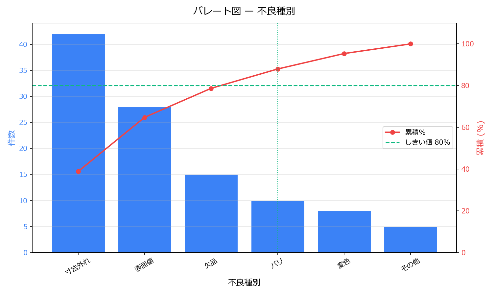

# パレート図 自動生成スクリプト（無料配布）

CSV の不良データから **パレート図**（降順棒グラフ＋累積%折れ線＋しきい値線）を1コマンドで PNG 出力する Python スクリプトです。

HandaLab 無料配布 / 解説記事 → [Zenn](https://zenn.dev/handa_lab)

---

## 何ができるか

- CSV / Excel の不良データを読み込んでパレート図を PNG 出力
- 集計済みデータ（不良種別＋件数列）と生データ（1行1件）の両方に対応
- 累積 % の折れ線と 80% しきい値線を自動描画
- pandas + matplotlib だけで動く（追加インストール最小限）



---

## 使い方（3ステップ）

```
# 1. 依存インストール
python -m venv .venv
.venv\Scripts\activate        # Windows
source .venv/bin/activate     # Mac / Linux
pip install -r requirements.txt

# 2. pareto.py 先頭の「設定」ブロックを書き換える
CSV_PATH     = Path(__file__).parent / "あなたのデータ.csv"
ITEM_COLUMN  = "不良種別"   # 分類軸の列名
COUNT_COLUMN = "件数"       # 件数列（生データなら None）
THRESHOLD    = 80           # しきい値（%）

# 3. 実行
python pareto.py
```

出力は `output/pareto_<列名>.png` に保存されます。

---

## 入力データの形式

**形式A：集計済みデータ**

```csv
不良種別,件数
寸法外れ,42
表面傷,28
欠品,15
```

**形式B：生データ（1行1件）**

```csv
不良種別
寸法外れ
寸法外れ
表面傷
```

`COUNT_COLUMN = None` にすると出現回数を自動集計します。

---

## もっと高度な分析がしたい場合

本スクリプトはパレート図単体の最小ツールです。  
**パレート図・ヒストグラム・散布図・管理図・グラフをまとめて生成 + Excel/HTML レポート出力**が必要な方は:

→ [QC七つ道具 作図セット — HandaLab BOOTH](https://handa-lab.booth.pm)

---

## フィードバック・ご要望

実際に使ってみての感想・欲しい機能があればぜひ教えてください。

→ [現場エンジニアへのアンケート（Google フォーム）](https://forms.gle/ZPgzZXjPArhmY6Jr6)

---

## 最新ツール・記事を受け取る

HandaLab では製造現場向けの Python ツール・解説記事を継続発信中です。  
更新を受け取りたい方は **Zenn または note のフォロー**をどうぞ。

- Zenn（技術記事）→ https://zenn.dev/handa_lab
- note（ツール紹介）→ https://note.com/handa_lab

---

## ライセンス

MIT License — 商用・業務利用可、改変自由、コピペ歓迎。
